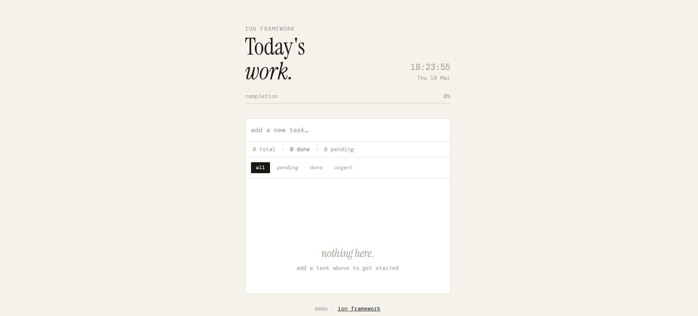

# Ion Todo — Demo Application

A task management application built as a reference implementation for the [Ion framework](https://github.com/matheusmntt/ion). Every feature of Ion is exercised here in a realistic, working context — not as isolated snippets, but wired together as a real application.

> This project exists to answer the question: *"How do I actually use Ion?"*



---

## Overview

Ion Todo demonstrates how to structure a client-side application using Ion's primitives in a clean, maintainable way. The stack is intentionally minimal:

- **[Ion](https://github.com/matheusmntt/ion)** — reactive state, bindings, components
- **[Tailwind CSS v4](https://tailwindcss.com)** — utility-first styling via the Vite plugin
- **[Vite](https://vitejs.dev)** — dev server and bundler
- No other runtime dependencies

---

## Getting Started

```bash
# Install dependencies
npm install

# Start the dev server
npm run dev

# Build for production
npm run build
```

---

## Project Structure

```
ion-todo/
├── index.html                   # Markup — all data-* attributes live here
├── vite.config.js               # Vite + Tailwind v4 plugin
├── package.json
└── src/
    ├── main.js                  # Entry point — wires everything together
    ├── styles.css               # Tailwind entry + custom CSS
    ├── stores/
    │   ├── todos.js             # Domain state + computed properties
    │   └── draft.js             # Form/UI state
    ├── components/
    │   ├── TodoApp.js           # Shell component (input, filters, clear)
    │   └── TodoList.js          # List renderer component
    ├── effects/
    │   └── index.js             # App-level reactive effects
    ├── plugins/
    │   └── tooltip.js           # Custom data-tooltip binding plugin
    └── utils/
        ├── toast.js             # Toast notification helper
        └── html.js              # XSS-safe HTML escaping
```

---

## Ion Features in Use

Every Ion primitive is used here. The table below maps each feature to where it appears in the codebase.

| Feature | File | Description |
|---|---|---|
| `App.store()` with `computed` | `stores/todos.js` | Domain state with 9 computed properties |
| `App.store()` isolated | `stores/draft.js` | UI-only state scoped to the input form |
| `store.subscribe()` | `components/TodoList.js`, `effects/index.js` | Re-render list and sync progress bar |
| `store.watch()` | `stores/draft.js`, `main.js` | Reactive flags and completion toast |
| `store.onChange()` | `main.js` | Dev-mode change logging |
| `App.effect()` | `effects/index.js` | localStorage persistence, page title, clock |
| `App.batch()` | `components/TodoApp.js` | Atomic form submission across two stores |
| `App.component()` | `components/TodoApp.js`, `components/TodoList.js` | Component registration and lifecycle |
| `App.bind()` | `main.js` | Scoped store-to-DOM connections |
| `App.use()` | `main.js`, `plugins/tooltip.js` | Custom binding directive via plugin |
| `applyBindings()` | `main.js` | Manual binding for the draft store |
| `data-bind` | `index.html` | Text bindings for all stat counters |
| `data-show` | `index.html` | Conditional visibility for stats, empty state, clear button |
| `data-model` | `index.html` | Two-way binding on input and priority select |

---

## Architecture Decisions

### Two stores, two scopes

The application uses two separate stores rather than one monolithic state object.

**`todosStore`** holds domain state: the task list and active filter. It owns all derived values as computed properties — totals, counts, filtered views, and the completion percentage.

**`draftStore`** holds UI state scoped to the input form: the current text, selected priority, and a `typing` flag that controls whether the priority select is visible. This store is intentionally isolated — typing in the input does not trigger re-renders in the task list.

```
todosStore { items, filter } → computed: totalCount, doneCount, pendingCount,
                                         highPriorityCount, hasHighPriority,
                                         hasDone, isEmpty, progress, filtered

draftStore { text, priority, typing }   → watch: text → sets typing flag
```

### Scoped bindings — never bind two stores to the same root

Each store is bound to the exact DOM elements that carry its attributes. Binding a store to a wide root causes it to connect `data-show` and `data-model` attributes that belong to a different store — setting elements hidden or writing to the wrong state.

```js
// ✓ Correct — each store owns its own elements
App.bind(header,    todosStore)  // data-bind="progress"
App.bind(statsRow,  todosStore)  // data-bind="totalCount", data-show="hasHighPriority"
App.bind(filterBar, todosStore)  // data-show="hasDone"
applyBindings(draftForm, draftStore) // data-model="text", data-show="typing"

// ✗ Wrong — todosStore would reach data-show="typing" and hide the input
App.bind(card, todosStore)
applyBindings(card, draftStore)
```

### Components own their events, stores own the data

Components attach event listeners and delegate to plain mutation functions. They never store application state internally — all state lives in stores. This makes the components stateless from Ion's perspective and easy to reason about.

```js
// TodoApp component: owns the listeners, calls plain functions
input.addEventListener('keydown', onKey)   // → addTodo()
addBtn.addEventListener('click', onAdd)    // → addTodo()
filterBar.addEventListener('click', onFilter) // → todosStore.state.filter = ...

// TodoList component: owns the render loop, nothing else
const unsubscribe = todosStore.subscribe(render)
```

### `subscribe()` for computed-dependent side effects

`App.effect()` tracks dependencies by intercepting property access through the reactive Proxy's `get` trap. Computed properties are defined via `Object.defineProperty` directly on the proxy object — their getters execute without going through the trap, so `effect()` never registers them as dependencies and stops updating after the first run.

For side effects that depend on computed values, use `store.subscribe()` instead. It fires on any state mutation, which is the correct trigger since computed values always derive from raw state.

```js
// ✗ effect() doesn't track computed properties — runs once and stops
App.effect(() => {
  el.style.width = todosStore.state.progress + '%'
})

// ✓ subscribe() fires on every mutation — correct for computed-derived effects
todosStore.subscribe(() => {
  el.style.width = todosStore.state.progress + '%'
})
```

### `App.batch()` for cross-store mutations

Adding a task mutates two stores: `todosStore.state.items` gets the new task, and `draftStore.state.text` is reset to empty. Without `batch()`, each mutation triggers a separate notification cycle — the list would re-render twice. `batch()` defers all notifications until the function exits, producing a single flush.

```js
App.batch(() => {
  todosStore.state.items = [newItem, ...current]
  draftStore.state.text     = ''
  draftStore.state.priority = 'medium'
})
```

### Never call `App.destroySubtree(el)` on a component's own element

`TodoList.render()` clears and rebuilds the list on every state change. An earlier version of this code called `App.destroySubtree(el)` before clearing — which destroyed the `TodoList` component itself, calling its `cleanup()` and removing its store subscriber. The list would render once and never again.

`destroySubtree` is intended for removing entire sections of the DOM that contain nested Ion components. The `<li>` items rendered by `TodoList` are plain DOM — no cleanup needed, `el.innerHTML = ''` is sufficient.

---

## Startup Sequence

The `main.js` entry point follows a deliberate order:

```
1. App.use(plugin)          — plugins before bindings, so directives are available
2. registerEffects()        — effects before start, so they run on first load
3. registerTodoApp()        — register component factories
4. registerTodoList()       — register component factories
5. App.bind(el, store)      — connect stores to specific DOM elements
6. applyBindings(el, store) — connect draft store to the input form
7. todosStore.watch(...)    — app-level watchers
8. todosStore.onChange(...) — dev-mode logging
9. App.start()              — mount all registered components
```

`App.start()` is always last. It scans the DOM and calls every registered component factory. By the time it runs, stores are ready, effects are active, and bindings are connected.

---

## License

MIT

---

<div align="center">
  <sub>Built with <a href="https://github.com/matheusmntt/ion">Ion</a> — a tiny reactive micro-framework for server-rendered applications.</sub>
</div>
